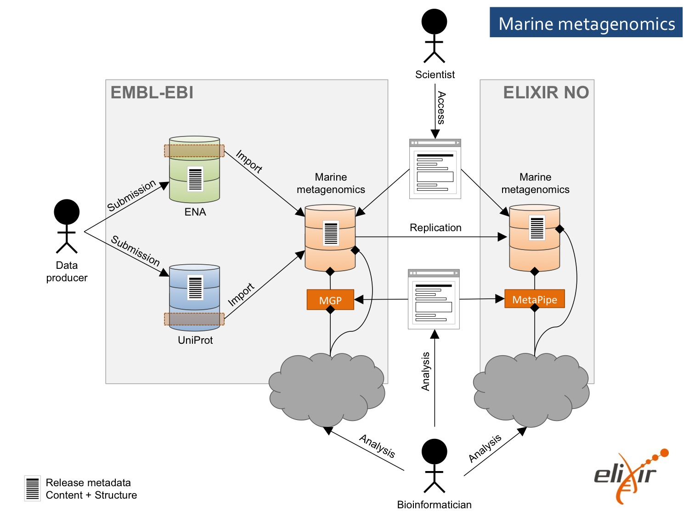

# EliXir Excelerate Requirements

## Background
Metagenomics has the potential to provide unprecedented insight into the structure and function of heterogeneous communities of microorganisms and their vast biodiversity.
Microbial communities affect human and animal health and are critical components of all terrestrial and aquatic ecosystems.
They can be exploited e.g. to identify novel biocatalysts for production of fuels or chemicals (bioprospecting), make functional feed for aquaculture species, and for environmental monitoring.
However, in order to expand the potential further for the research community and biotech industry, especially within the marine domain, the metagenomics methodologies need to overcome a number of challenges related to standardization, development of relevant databases and bioinformatics tools.

New and emerging sequencing technologies, integration of metadata gives an extra burden to the development of future databases and tools.
The Use Case *"Marine metagenomic infrastructure as driver for research and industrial innovation"* will contribute to the overall objectives of the ELIXIR-EXCELERATE project by developing research infrastructure and service provision specific for the marine domain in order to enable metagenomic approaches responding to societal and industrial needs.
The outcome of the proposed Use Case will meet the major needs expresses by the marine domain (e.g. ESF Marine board Position Paper 17 *"Marine Microbial Diversity and its role in Ecosystem Functioning and Environmental Change"* and Position Paper 15 *"Marine Biotechnology: A New Vision and Strategy for Europe"*).

## The ELIXIR EXCELERATE Scientific Use Cases
Marine metagenomic infrastructure provides a web based portal that will act as a driver for research and industrial innovation.
The portal will be populated with data produced by running pipelines (including curated Galaxy workflows) on internal HTC clusters using data generated from within the collaboration, but also collected from other data sources. These pipelines will be ported from the current cluster to the future cloud infrastructure.

## Tasks

### Task 6.1: Development and implementation of a comprehensive metagenomics data standards environment for the marine domain

To maximize the impact and long term utility and discoverability of metagenomics datasets, it is essential for the experimental methods and data acquisition/storage protocols to be established.
In Task 6.1, we will bring together a comprehensive metagenomics data standards environment in collaboration with marine experimental scientists, data providers, end users and the existing communities involved in marine standards development.

The environment will bring together three components:

1. **Data format conventions and standards** will address the various data types for which sharing is required, that will include contextual data (e.g. sample information, expedition-related data), metadata (e.g. provenance and tracking information, descriptions of experimental configurations and bioinformatics tools in use) and data (e.g. raw sequence data, aligned reads, taxonomic identifications, gene calls).

2. **Reporting standards** will address community-accepted thresholds for richness/precision that are required to make data useful, including depth of raw machine data, such as resolution of sequence quality scoring, conventions for references to reference assemblies and minimal reporting requirements for contextual data.

3. **Validation tools** will address the automated validation of compliance with conventions and standards and the meeting of minimal reporting expectations for given datasets in preparation by the marine research community.

In this task we will bring together components that exist already; in particular the contextual data and metadata reporting standards we have developed under the Micro B3 project (EU FP7), data standards and conventions developed around our European Nucleotide Archive (ENA) programme, such as CRAM, FASTQ conventions, work existing in the biodiversity and molecular ecology domains (such as tabular data conventions and BIOM matrices) and construct new components as required.
The major output of this work will be a set of well described and navigable elements to aid the marine community in the preparation, sharing, dissemination and publication of highly interoperable and comprehensive metagenomics datasets.

### Task 6.2. Establishment of marine specific data resources

Due to the data biases of existing reference databases, only about one quarter of sequences are annotated, and this fraction diminishes further when more diverse samples such as soil and marine are analysed.
To improve the characterisation of marine metagenomic samples, this task involves the construction of sustainable public data resources for the marine microbial domain.

Task 6.2 will be achieved by establishing marine microbial databases including reference genomes, nucleotide and protein databases.
The established databases, based on the standards developed in Task 6.1, will enhance the precision and accuracy of biodiversity and function analysis.
The reference databases will be non-redundant datasets generated from sequences acquired from ENA (as part of the International Nucleotide Sequence Database Collaboration), UniProt and other publicly available datasets.
In particular, we will use some of the higher-coverage and higher quality sequence outputs from the TaraOceans and Ocean Sampling Day metagenomic projects, to build high quality marine specific reference databases.

All datasets will be checked with respect to quality, consistency, and interoperability, and in compliance with standards developed in Task 6.1.
The respective knowledge-enhanced databases will be the cornerstone for sustainable analysis of marine metagenomics sequence data.
The databases will be developed in collaboration with members of the ESFRI infrastructures EMBRC and MIRRI and made publicly available through ELIXIR.

### Task 6.3: Gold-standards for metagenomics analysis
The majority of existing metagenomics analysis platforms, while providing insights into the prokaryotic taxonomic diversity and functional potential for individual samples, lack the tools that enable discoverability across samples and industrial innovation.
This task will focus on the evaluation and implementation of new tools and pipelines in order to accelerate research, discoverability and innovation, reducing time to market for new products.

In combination with new standards and databases developed in Task 6.1 and Task 6.2, respectively, new tools for community structure (microbial biodiversity), genetic and functional potential will be evaluated and implemented for environmental applications.
For industrial application tools and pipelines for the identification of gene products (e.g. enzymes and drug targets) and pathways will be implemented and made publicly available.

The evaluation and implementation will be performed in near collaboration with end-users (research groups, environmental centres, biotech companies) to ensure usability for the end user community in order to improve quality, productivity and functionality, as well as reduction of costs for the end-users.
New tools and pipelines will be made publicly available through the e.g. META-pipe (ELIXIR-NO), EBI Metagenomics Portal (EMBL-ELIXIR) and/or EMBL Embassy cloud technology.
Technical requirements will be mapped by WP3 and implemented to meet the requirements of the ELIXIR community.

The continued advancement of sequencing technologies and the growing number of public marine metagenomics projects means that it is becoming increasingly difficult to mine these vast datasets.
In this task, initially a web-based search engine will be developed for the interrogation of marine metagenomics results available from the EBI Metagenomics Portal, based on combinations of queries to our web services (already in existence, or to be built as part of existing projects outside ELIXIR-EXCELERATE) for the discovery of data through metadata, taxonomic and functional fields.
This will extend the back-end search functionality that is to be developed as part of ongoing efforts.
In addition to being downloadable, we will enable search results to flow into an expanded comparison tool (currently limited to gene ontology terms from samples in the same project), to allow more indepth analysis of a user selected datasets, allowing functional and taxonomic comparisons.

In the second phase of this task, the search engine will build upon the data exchange formats in Task 6.1, and federate the search across different pipeline results sets (e.g. META-pipe), so that different results based on the same underlying dataset, can be amalgamated into a single search.
This will dramatically enhance the discoverability across different marine datasets, allowing the identification of common trends and/or differences.
These tools will be developed using user-experience testing and in collaboration with end users to ensure they are fit for purpose.

### Task 6.4: Training workshops for end users
In this task training workshops will be established, in collaboration with WP11 “ELIXIR Training Programme”, for end-users with the aim to facilitate accessibility, by training European researchers and industry to more effectively exploit the data, tools and pipelines, and compute infrastructure provided by the ELIXIR marine metagenomics infrastructure. These training workshops and materials will be converted to online training resources, extending the reach of the workshop.

## Requirements and Limitations
The result of these tasks will also be meta-pipe 2.0.

*   META-pipe should become ELIXIR Named Service.
    *   For now, marine reference database should be part of the Named Service.

20 GB per run with miseq.

50 runs a year = 1TB
x20 after processing = 20 TB
x10 to accomodate other users = 200 TB

other machine nextseq = x10

Dependencies
------------

Deliverables
------------

Open Issues
-----------
* Task 6.2:
- But before we need to pull data from ENA (NorStore) or other data storage sites such as NCBI. 

Detailed Description
--------------------

Operational Scenario

User Interface

Architecture

Performance Considerations 

Data Sources and Structure 

Processing Pipeline

Data Storage

Workflow Manager

Stallo Integration

...

Programming Interface(s)
------------------------

Evaluation
----------

References
----------

ELIXIR Excelerate documents:
*   [all](https://drive.google.com/drive/folders/0B7btK9HAXhx1flN3ek9uV05hTUVsb2ZMX1VDTVZLaFRQLWduOXYtZHZ3QVNJc0RfWU1jSUU)
*   [Marine metagenomics scientific use case](https://drive.google.com/drive/folders/0B4WQQq4hwmbQfjNSYl9zdkpTeDFqV2c2dW5QVk5HVk56NlZGaXlacGluZFJIdGpWLXJWYWs)
*   [Technical services work package](https://drive.google.com/drive/folders/0B4WQQq4hwmbQfkUtdUJzU2JScTVTcU92aFFhcEhTWG82eFFMMmxlZVFZQ2xaME1jNy1uQTQ)

Future Directions
-----------------

Old stuff
---------

Action Points:

1. Main goal: integrate storage with the MetaPipe (or any other pipeline).

2. Get numbers from EBI: 
	- How much of ENA is marine?
	- How can we figure it out ourselves?
	- Ask Alex Mitchell or one of the Rob's people.

3. Figure out how MetaPipe (or any other pipeline) can use the Storage. 
	- User raw data.
	- MetaPipe provenance and intermediate data. Maybe some meta data on the pipeline runs.
	- MetaPipe  results (to the archive).
	- Reference database (task 6.2).

4. Figure out if we can just pull data to NorStore, EUDAT links: Geant.
	As per task 6.2 actions.

## Notes

Figure out the numbers: 
	how much storage do we need?
	how much do we need to transfer?

Contact EBI and ask for the numbers, but first figure out what to ask for.
ENA is 2.5 PByte compressed.
But if you cut humans ans mice there may not be much left, and they are not relevant for the marine biology.

Ask Roy for requirements documents to compile.

## Version History

This design document is based on:
* The architecture of META-pipe 1.0 ([paper](https://udoc.uit.no/prosjekt/sfb/Delte%20dokumenter/papers/Draft_metapipe.docx?Web=1))
* The goals and descriptions in the [ELIXIR Excelerate grant application](documents/ELIXIR-EXCELERATE_PartB_1-3.pdf)
* The description and requirements of our [Marine metagenomics scientific use case](https://docs.google.com/document/d/1gMKFrcbzuN9BSREU1VDnlml-bl6KSOnfyQbJGh20L5s/edit#)

Version 1.0 (deliverable December 2016)

## Terminology

[ELIXIR](http://www.elixir-europe.org/): European infrastructure for life sciences.

[ELIXIR Excelrate](documents/ELIXIR-EXCELERATE_PartB_1-3.pdf): the infrastructure project in Elixir where META-pipe is in a use case.

EMBRIC:

MIRRI:

## Overview

3 years timeline. (Sept. 2018)

#### Notes on 6.1
Maintain the meta-data of MetaPipe runs along with provenance/linage of data involved in the analysis.
Each time MetaPipe runs an analysis all the information to grant the reproducibility of the analysis must be collected and stored automatically.
The set of information include the MetaPipe version and the provenance of the dataset object of the analysis.
Candidate for the storage is NorStore/EUDAT.

#### Notes on 6.2
As specified in the [Work Package 6 Description](https://docs.google.com/document/d/1_CHt8vW-50bxL4X4hzHxqThURzmo7Tz7KfKQozSTPnQ/edit#) document, this task is to provide a metagenomic marine microbial database.
The database must be publicly available
1. Replicate the marine reference database from Tromsø to EBI.
	- Public information.
	- Content/Size: ? 
	- Schema: we should be ENA compliant (which is NCBI compliant in the data structure/annotation), but we want to be more flexible in our schema.
	- Start with the Prokaryotic bacteria, they ar connected to the MIRRI infrastructure (3K genomes could be astart).
	- Follow up with the eukaryotic adn viruses later.
	- There is standard to be followed: MIGS, to store the genmes.
	- We should have a manually cureted index of the database as a gold standard.
	- Figure out what the database should be.
	- And add a database for the protein sequences and peptides.
	- Gap analysis of the taxonomic tree in the database, MIRRI can help.

2. Check if ENA (NorStore) can notify updates to pull new data automatically.
	- In alternative scan ENA (NorStore) regularly for new data. Automatically?
	- Public information.
	- Content/Size: ?
	- Keep copies of the releases of the data and allow MetaPipe to run on each release.

3. API for programmatic access (pipeline) and WEB search (human).

4. The storage should be provided by NorStore.
	- Can they do it?

#### Notes on 6.3
1. Copy private data from ENA (NorStore) to MetaPipe (UiT or elsewhere)

2. Scale to the biggest dataset available in ENA, Tara Ocean or OCD.
	- Figure out how long can it take to process both on Stallo.

3. MetaPipe needs to access private data on behalf of the user, hence AAI.

4. Compare/combine/integrate/interrogate new results with old results from both MGP and MetaPipe or maybe others.

5. Figure out if/how the two pipeline can be interconnected. Output from a pipeline can be input of the other. Or even interconnection among stages of the pipelines.

