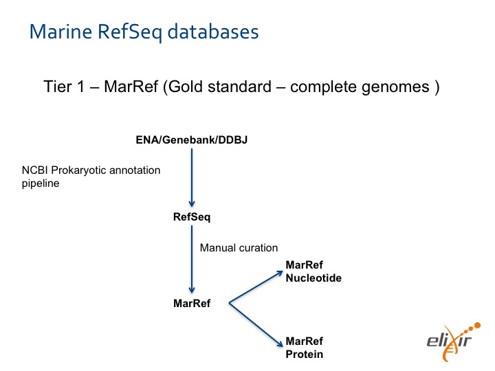
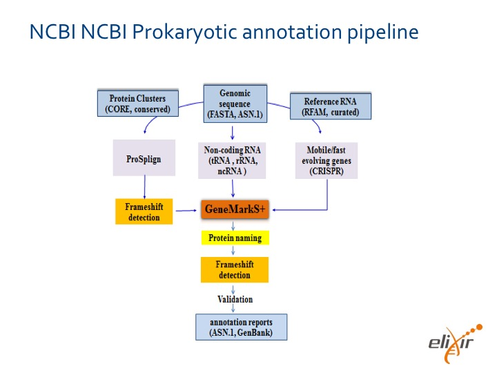
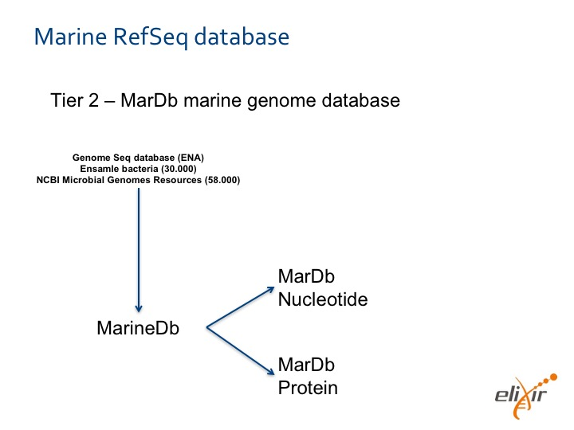
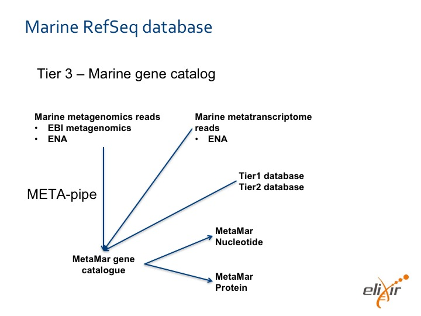

# Marine Reference Database Design

## Summary

This  document describes the technical design of the marine reference database developed in the Elixir Excelerate project (described in detail in the [[Background chapter in META-pipe]]). The reference database is closely integrated with the [[META-pipe pipeline]], the EBI Metagenomics Portal, and the Elixir technical services.

## Terminology

### NCBI definitions

* **Reference genomes**: manually selected “gold standard” complete genomes with high quality annotation and the highest level of experimental support for structural and functional annotation. 
* **Representative genomes**: representative genome for an organism (species); for some diverse species there can be more than one. For example, pathogenic and non-pathogenic E. coli will each be assigned a reference. 
* **Variant genomes**: all other genomes from individual samples representing genome variations within the species. 

### Other definitions

* **Gene catalog**:...
* **ENA entry**:...

## Dependencies

### Standards:

* Metagenomic data standards environment (developed as part of Elixir Excelerate marine use case).
* NCBI defintions for reference genomes, representative genomes, and variant genomes.

### Databases:
* Eurpeoan Nucelitide Archive: for retrieving annotated genomes, and metagenomics raw sequence reads.
* National Center for Biotechnology Information: for access to biomedical and genomic information.(?)

### Pipelines:
* META-pipe: to assemble ENA metagenomes.

### Other infrastructure projects:
* MIRRI

### Infrastructure Services:
* Storage: online database, backup, versioning
* Transfer: synchronize the reference database at EBI and NO
* Cloud: computation resources for assembly and other computation required to populate database
* AAI: management of privileged user groups
* Server: to host database user interface

## Deliverables 

* Initial draft for database design and requirements ready for review by project partners (**this document!**) by 06.03.2016
* Modified design document by <teleconference>.04.2016
* Beta-version due by Christmas 2016

## Open Issues

See also the [META-pipe issue tracker](https://sfb-uit.atlassian.net/).

### Critical:

* ENA private data access
* Access to the necessary computational resources required to assemble metagenomes and annotate using META-pipe

### Non-critical:

* Decide if and how to include eukaryots and viruses in gold standard database

## Detailed Description

We will establish three different databases with different quality:
* Tier 1 - **MarRef** - is the Gold Standard built upon complete marine archaeal and bacterial genomes available in NCBI Prokaryotic RefSeq Genomes database. It is manually curated.
* Tier 2 - **MarDB** - includes all complete and non-complete prokaryotic genomes. We will manually curate MarDB in the beginning since we expect the needed meta-data of old experiments to be incomplete. Later it will be automatically updated using the standards developed in this project.
* Tier 3 - **MarCat** - is the gene catalogue. It will be based upon automatic annotation of assembled marine metagenomics and metatransciptomics reads.

### Operational Scenario

The two main operations for the database is update and query. The updates differ for each tier. We  will continuously update the database, but the updates are not visible for end-users until a new version of database is released. We will release a new version on the first day of each month.

We provide common user interfaces and APIs for programmatic queries for all tiers. In addition, we provide an interface for bulk download of the database.

**MarRef** (Tier 1) is updated when RefSeq is updated. It is manually curated, and we will create a new version with each new version of RefSeq. We will initially use the NCBI prokaryotic annotation pipeline.

**MarDB** (Tier 2) is updated when one of the source data repositories is updated (ENA, Ensemble bacteria, Microbial Genomes Resources, and possibly more). We will initially manually curate the content due to possible lack of proper metadata for old experiments. Once the metadata content has been standardised we will automatically update the database. How ???

**MarCat** (Tier 3) is updated when a new marine public dataset becomes available:

1. We detect new datasets, by periodically querying ENA (or others) for marine datasets (this includes data analysed by META-pipe and EBI MG datasets since these are also uploaded to ENA).
2. The data is manually checked to determine wether the data format and content can be classified and annotated by META-pipe, and to 
ensure standards are followed and that the required metadata is provided.
3. If the datasets has not been processed by META-pipe, it will be processed. META-pipe is designed to scale to dataset sizes, and produce results wit the highest possibility quality. 
4. The quality of the analysis results is manually checked before it is added to MarCat.
5. Before adding the results to MarCat, there is automatic removal of redundant genes.
6. The ??? is added to MetaMar.

### User Interface

We provide a web based user interface for the database users. 
There are three type of users, and hence three types of interfaces.

**End-users** query the database using a web based interface. This interface is similar to for example NCBI microbial genomics.

**Curators** populate the database by hand. <Renzo has ideas for curator tools.>

**Administrators** manage configurations and perform general maintenance.

### Architecture

The databases are stored in an SQL database. Versioning is enforced by timestamps in the RDBMS. The input data for the Tier 3 database is stored in HDSF for analysis using the Spark based Meta-pipe. We use gridFTP to tranfser raw reads to be processed by Meta-pipe. The main replica of the database is backed up on the Norwegian NorStore resources. Users access the database content using a Web GUI that access the data using a REST API. The final data is served directly from the RDBMS, otherwise we store versions for download in HDFS and use the Elixir data replication service to replicate the database to other sites.

### MarRef

MarRef is the marine **gold standard** database. It contains complete genomes, and provides reference nucleotide and proteins. Initially there will be about 1000-2000 genomes of which 500 are complete. Hence, the database size will be ???. The data will be added through manual curation. We therefore expect it to grow with ??? and have a size of ??? after four years.

MarRef entries contains: … complete genome assemblies, reference + representatives. Whole chromosomes? Nucliotides () + proteins (linked to uniprot IDs).

The data is processed using the NCBI prokaryotic annotation pipeline.

### MarDB

MarDB is the marine genome database. It contains ??? Genome sequence datbaase (ENA), Ensembl bacteria (30K), NCBI microbial genomes resources (58.000). Size … Growth …

MarDB entries contain: 

The data is processed using ???

### MarCat

MarCat is the marine gene catalog. It contains the nucleotides and proteins output by META-pipe for marine metagenomics reads and marine metatrancsiptome data processed. It also contains the MarRef and MarDB data. 

It will contain millions of genes. Intially, we will add 1??? public marine prokaryotic datasets downloaded from ENA (the raw data is 40 TB uncompressed size and the results are ???). As more data becomes publicly available it will be processed by META-pipe and added to MetaMar. We therefore expect the size to double each year, and the database size to reach ???TB after 4 years.

### Performance and Scalability Considerations

The databases are queried by end-users interactively. Hence they REST APU should support query times less than 5 seconds. The databases are also used as input for pipelines. These should be downloaded with a throughput of at least ??? 

Database update times should be a few seconds. Data should be inserted without blocking interactive users. Versioning should also be implemented without a need to lock the database. It should be possible to backup and replicate the data at ??? 

Initially the database size, including raw input data, is 40TB (uncompressed). But the data size may double every year, hence the storage architecture should scale to at least 600TB. Most of this data will be the raw data for MarCat (Tier 3). We expect the combined output data of MarRef, MarDB, and MarCat to be less than 1TB in size after four years.

### Data Source Integration

How is it done for **MarRef**???

How is it done for **MarDB**???

MarCat will get the raw data from ENA, META-pipe, EBI MG, ... Giacomo: how do we know what to get, what we already have, and when new data is available? Also which interfaces do we use to access the data? How is ENA/ EMG data structured and what are the dependencies?

### Data annotation

MetaMar processes the raw metagenome and metatranscroptomics data using META-pipe as follows:
1. After downloading and verifying a dataset, the administrator creates a META-pipe job for the dataset and submits it for execution on an Elixir META-pipe resource.
2. The job is run as the MarRef user.
3. The results are retrieved by the administrator and manually checked, before adding these to MarRef.

The administrator uses the ??? tool to automatically remove redundant genomes. Removed genomes will be marked/ recorded ???

### Stallo Implementation

We will initially implement the database on the Stallo resources at the University of Tromsø. 

Giacomo: how can we implement the databases on Stallo???

### cPouta Implementation

We will also modify the database implementation for the CSC cPouta cloud. Lars Ailo: what must be done???

### Data Storage Infrastructure Integration

Giacomo: Which and how much resources do we need from NorStore and EUDAT??? How can we integrate with these services??? What accounts etc do we need???

### Backup, versioning, and replication

We use the RDBM system to automatically maintain database versions: Giacomo: details???

Giacomo: How do we backup the databases???

There will several replicas of the databases. The master replica will be in Tromsø. It will automatically be replicated through the ELIXIR data replication service.

## Programming Interface

### Updates

### Queries

### Curation

### Administration

## Evaluation

???

## Future Directions

TBD.

## References

* MicroD3 standard
* NCBI.
* TaraOcean have made gene catalog. MOCAT pipeline.
* Human gut microbiome gene catalog
* MetaRef: pan-genomic
* OSD